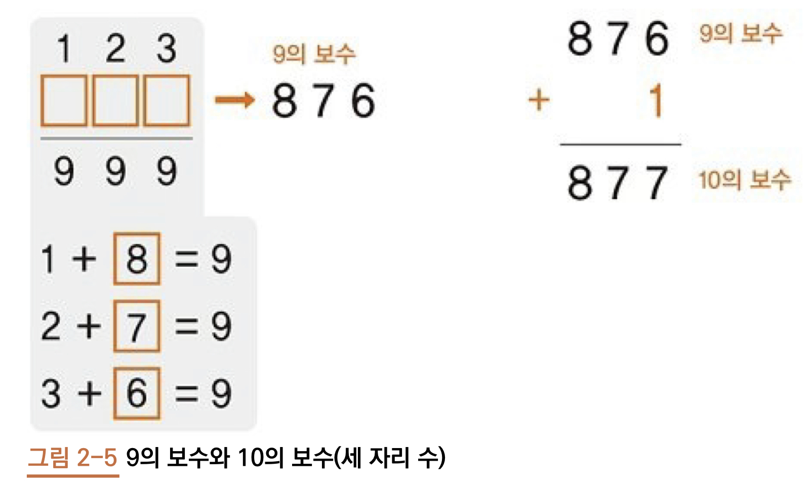
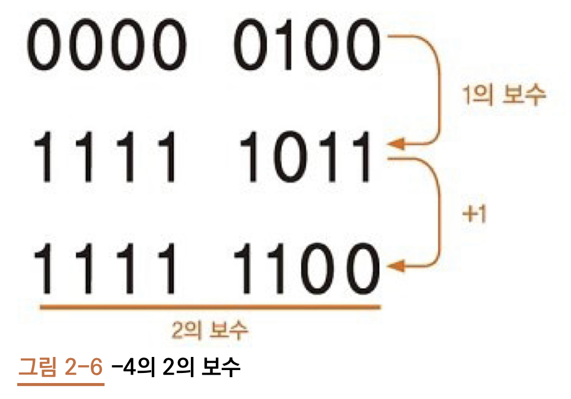

# 2장. 정수
## 1. 컴퓨터에서 수를 표현하는 방법
- 기본적인 16진수의 2진수 변환
---
```python
a, b, c = 0xa, 0xb, 0xc
bin(a), bin(b), bin(c)
```
	'0b1010', '0b1011', '0b1100'

---
- 메모리 주소를 나타낼 때 16진수를 사용하는 이유: 짧아서
---
```python
address_8bit = 0b00101101
hex(address_8bit)
```
	'0x2d'
---

## 2. 보수의 개념
- 보수란 `보충해 주는 수`
#### 1) 10진수에서 9의 보수와 10의 보수 계산

#### 2) 2진수에서 1의 보수와 2의 보수 계산

- 코드로 계산하기
---
```
>>> (-4).to_bytes(1, byteorder='little', signed=True)
b'\xfc'
```
---

#### 3) 2의 보수로 음수를 표현하는 이유
- 양수와 음수를 모두 양수처럼 저장한다면 `+0`과 `-0`을 표현하는 저장방식이 따로 생김
- 뺄셈시, 2의 보수 개념을 활용해 더한 뒤 제일 앞 bit을 drop하는 형식으로 계산

